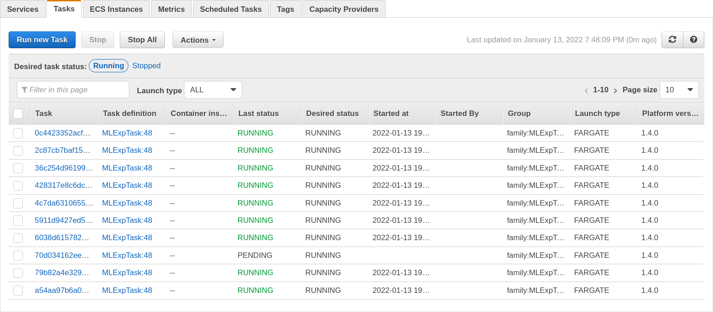
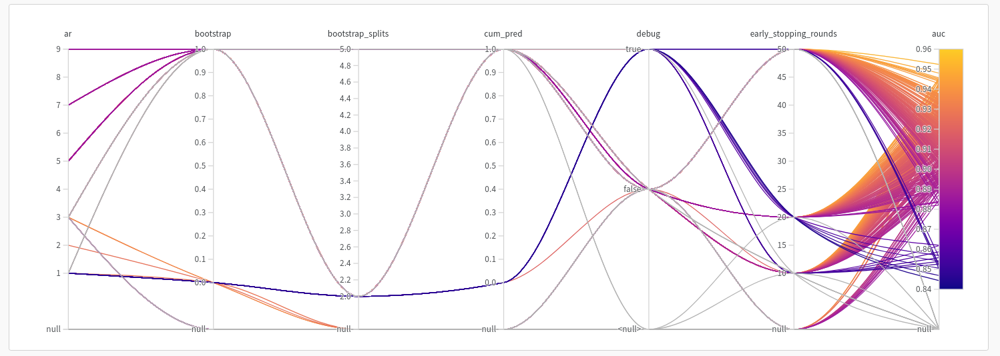

Cookiecutter - ML experiments in AWS the easy way
=================================================


[Cookiecutter](https://github.com/cookiecutter/cookiecutter) template for seriously 
scaling up hyperparameter tuning and ML experiments.

-   GitHub repo:
    <https://github.com/Yann21/cookiecutter-exp-launcher/>
-   Free software: BSD license
-   Read Medium [companion article](https://medium.com/@yann.hoffmaaann/using-compute-power-to-iterate-faster-through-ml-experiments-94c72342adaf)

Features
--------

-   Select number of AWS instances on which to run the experiment.
    
-   [WanDB](https://wandb.ai) integration: Visualize results in real time with parallel plot.
    
-   Plug and play: Change Python code to include your own model.


Quickstart
----------

Install the latest Cookiecutter if you haven't installed it yet (this
requires Cookiecutter 1.4.0 or higher):

    pip install -U cookiecutter

Generate a Python package project:

    cookiecutter https://github.com/Yann21/cookiecutter-exp-launcher.git

Then:

-   Follow cookiecutter instructions and enter AWS and WandDB credentials.
```{r}
$~ cd ml-exp/

Initialize AWS resources (need be done only once)
$~ ./cli.py init

Build and send the Docker application to AWS
$~ ./cli.py docker

Pull the trigger
$~ ./cli.py run 20
```


### Room for improvement
There are countless ways in which you can improve the application. Here are
some ideas:
- Use Bayesian optimization instead of grid search for faster convergence (WandB).
- Create your own EC2 instances instead of using the pricier Fargate.
- Initialize a spot ECS cluster.
- [...]

### Submit a Pull Request

I accept pull requests on this.
