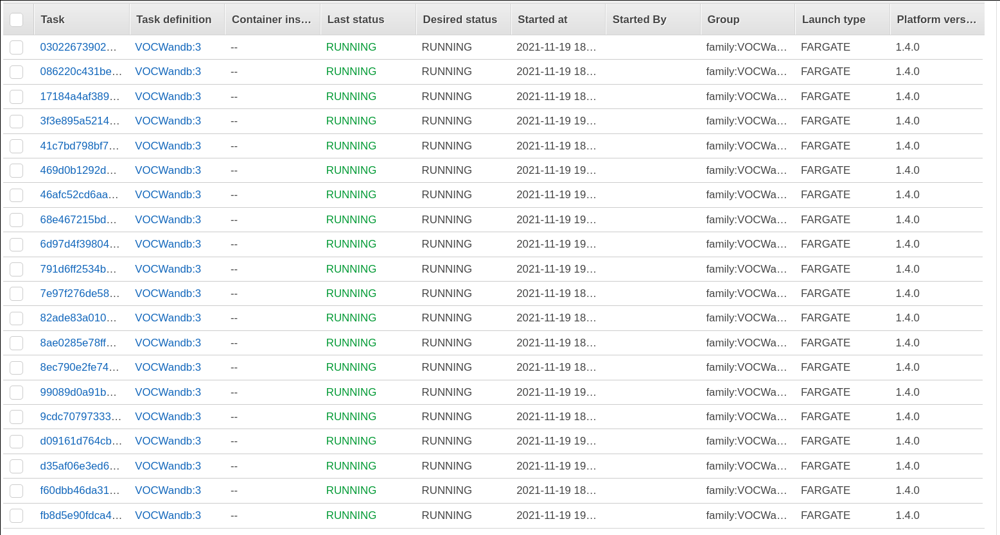

Cookiecutter - AWS Tuner in under 5 minutes
===========================================

[Cookiecutter](https://github.com/cookiecutter/cookiecutter) template for seriously 
scaling up hyperparameter tuning and ML experiments.

-   GitHub repo:
    <https://github.com/Yann21/cookiecutter-exp-launcher/>
<!---   Documentation: <https://cookiecutter-pypackage.readthedocs.io/>-->
-   Free software: BSD license

Features
--------

-   Select number of AWS instances on which to run the experiment.
    
-   [WanDB](https://wandb.ai) integration: Visualize results in real time with parallel plot.
    
-   Plug and play: Change Python code to include your own model.
-   Makefile: Automate common tasks.

Quickstart
----------

Install the latest Cookiecutter if you haven't installed it yet (this
requires Cookiecutter 1.4.0 or higher):

    pip install -U cookiecutter

Generate a Python package project:

    cookiecutter https://github.com/Yann21/cookiecutter-exp-launcher.git

Then:

-   Follow cookiecutter instructions and enter AWS and WandDB informations.
-   Execute pipeline with `make all`
-   TBD ...

### Room for improvement
There are countless ways in which you can improve the application. Here are
some ideas:
- Use Bayesian optimization instead of grid search for faster convergence (WandB).
- Create your own EC2 instances instead of using the pricier Fargate.

### Submit a Pull Request

I accept pull requests on this.
